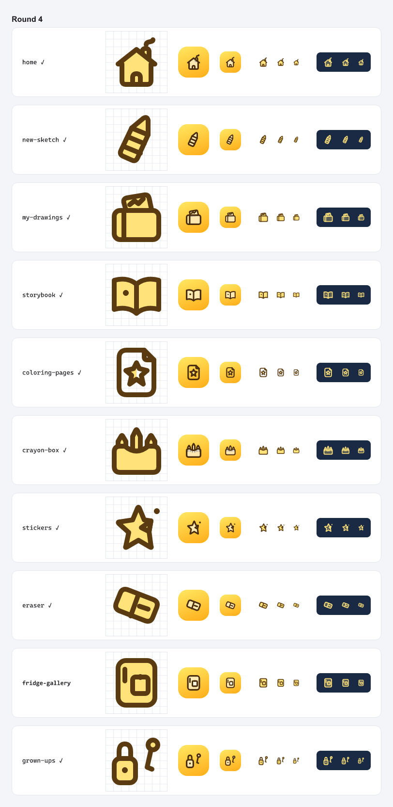
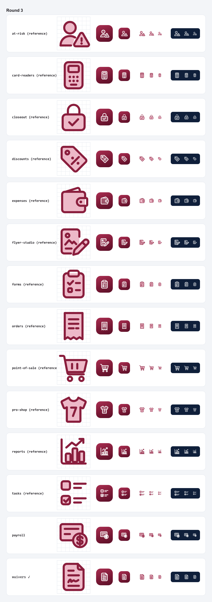
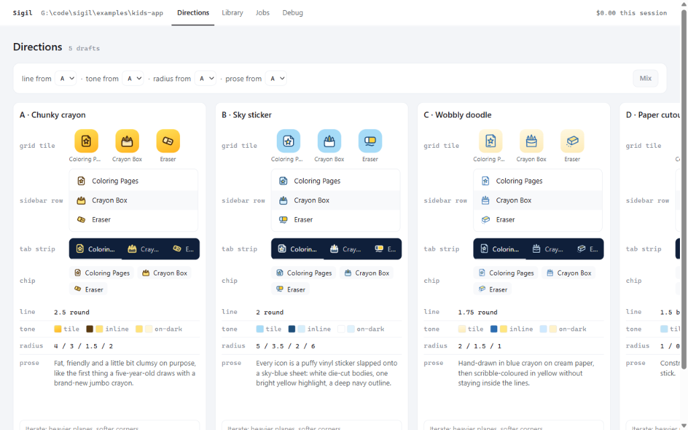
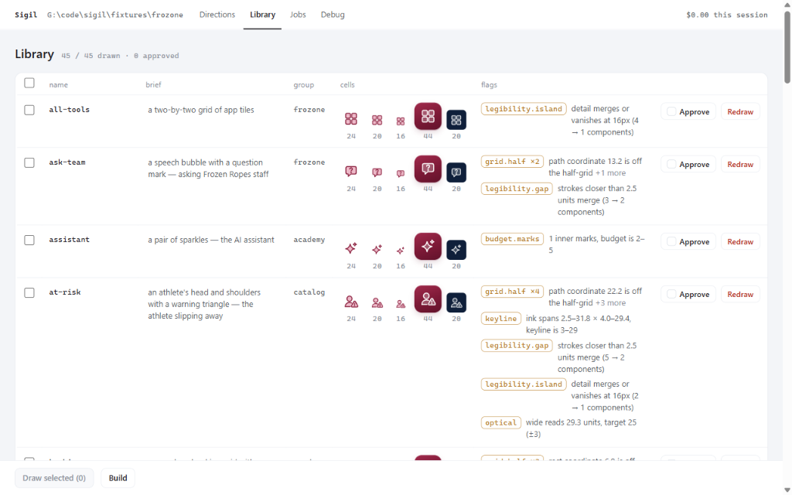
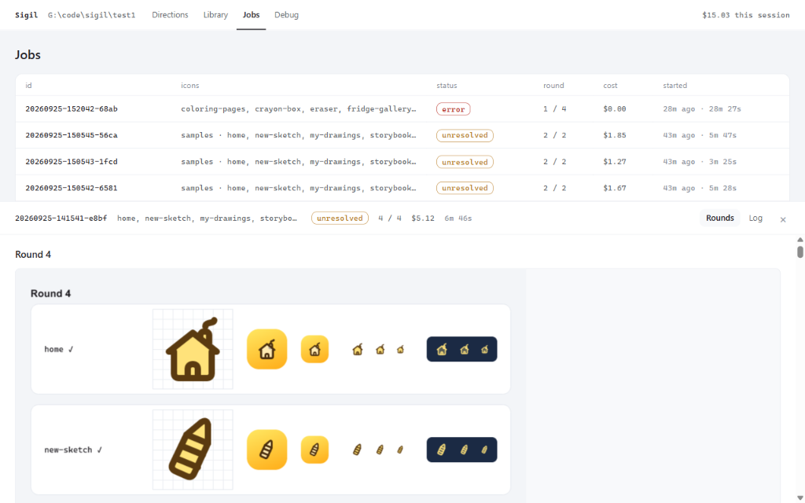
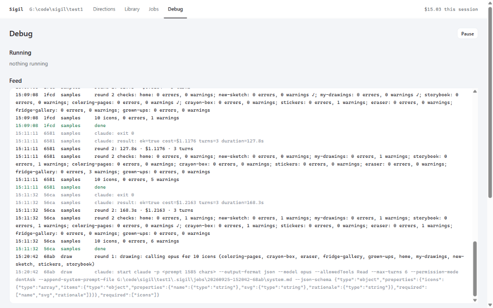

# Sigil

**A custom icon family for your app, drawn by Claude in a style you pick, checked by machine, shipped as typed React.**

Sigil replaces the stock Lucide icons on your navigation with icons of the real objects in your product: a batting helmet for Roster, a receipt for Orders, a crayon box for Crayon Box. It runs on your own Claude Code login, not an API key. Every drawing is rendered, looked at and fixed by the model before you see it, then linted and checked against the rest of the family.



## What you get

- **`icon.md`**: your style bible. Grid, stroke, corner radii, colour tones, detail budget, and prose about the product's voice and vocabulary. One file, human-readable, versioned with the code.
- **`icons/src/*.svg`**: plain SVG sources with no colour, just role groups (`plane`, `line`, `dot`, optional `accent`). Portable, diffable, editable in Figma.
- **`icons/dist/`**: generated on every build. Typed React components with `IconName` and `IconTone` unions, a CSS file with your tones, a sprite, flat SVGs per tone, and a contact sheet.
- **A lab**: a local page where you pick a style direction from five drafts drawn on your real nav items, mix and iterate them, then review, approve and redraw icons.

## How it works

Colour never touches a drawing. A **tone** in `icon.md` paints the roles, so five style directions are five colour maps over the same geometry and a rebrand is a CSS change.

The drawing loop is the product:

1. Sigil sends the model your `icon.md`, the briefs, and a rendered sheet of the reference icons and neighbours.
2. The model returns SVGs as structured JSON.
3. Sigil parses, lints and checks them, renders a PNG contact sheet at true sizes (128, 64, 44, 24, 20, 16), and hands the PNG plus the machine findings back into the same session.
4. The model reads the PNG, critiques each icon, and revises or passes it. Up to four rounds.

The machine checks catch what a single icon can't show: strokes that merge at 16px, detail that vanishes, ink outside the keyline, optical size drift, and two icons in the same group sharing a silhouette (the "three houses" bug).



## Requirements

- [Bun](https://bun.sh) 1.3 or later
- [Claude Code](https://claude.com/claude-code) installed and logged in (`claude` on your PATH). Sigil runs it headless with your existing subscription or key.

## Install

Not on npm yet. Link it from a checkout:

```sh
git clone https://github.com/dested/sigil
cd sigil
bun install
cd packages/cli && bun link
```

`sigil` is now on your PATH and follows the checkout.

## Quick start

In any project, new or old:

```sh
cd my-app
sigil lab
```

The lab opens on <http://localhost:7444>. On the Directions tab, give it the product name, brand colours and a sentence of hints, then either click **Suggest icons** (Claude proposes ten nav items with briefs), type your own as `name: what it draws` lines, or run `sigil scan --write` first to pull them out of your existing `lucide-react` usage.

**Generate five directions.** Each draft gets a name and its own `icon.md`, and draws six of your icons so you can compare them in context: a grid tile, a sidebar row, a dark tab strip, a 16px chip.



Mix facets across drafts ("line from A, tone from C, radius from D"), type a note and **Revise** a column, or **Pick** one. Pick writes `icon.md` and the sample icons into your project and builds `icons/dist`.

Then draw the rest:

```sh
sigil draw roster booking payroll --note "keep the helmets"
sigil check
sigil build
```



## Use the output

```tsx
import { Icon, Roster, Booking } from './icons/dist/react'
import './icons/dist/icons.css'

<Icon name="roster" tone="tile" size={44} />
<Roster tone="inline" size={20} />
<Booking tone="on-dark" />
```

`name` and `tone` are typed unions generated from your manifest and `icon.md`. A wrong name is a compile error.

Non-React consumers get `icons/dist/sprite.svg` and `icons/dist/flat/<tone>/<name>.svg`.

## icon.md

```md
---
sigil: 1
grid: 32
keyline: [3, 29]
stroke: 2
caps: round
joins: round
radius: { sheet: 3, box: 2, bar: 1.2 }
optical: { circle: 24, square: 22, tall: 25, wide: 25 }
roles: [plane, line, dot]
tones:
  tile:    { bg: { angle: 160, stops: ["#A12A4C 0%", "#62122B 100%"] }, line: "#FFFFFF", plane: "rgba(255,255,255,.26)", radius: "27%", scale: 0.6 }
  inline:  { line: "#8A1E3D", plane: "#EDB9C8", on: "#FFFFFF" }
  on-dark: { line: "rgba(255,255,255,.88)", plane: "rgba(255,255,255,.2)", on: "#0F1F3A" }
detail_budget: { inner_marks: [2, 5], min_gap: 2.5, min_px: 16 }
references: [forms, point-of-sale, pro-shop, orders]
---
# Icon style

## Voice
Sturdy two-colour objects from the GM's building, not a SaaS dashboard.

## Drawing rules
1. Draw the real object of the tool. A jersey for Pro shop, a receipt for Orders.

## Vocabulary
- batting helmet: the athlete
- cage lane: booking

## Never
- a generic document with a symbol on it
```

The frontmatter is the numbers; the prose is the taste. Both go to the model verbatim. The `references` are the house hand every later icon matches.

## Icon source format

```svg
<svg xmlns="http://www.w3.org/2000/svg" viewBox="0 0 32 32" data-sigil="1" data-brief="a batting helmet — the athletes on the roster">
  <g data-role="plane"><path d="…"/></g>
  <g data-role="line"><path d="…"/><circle cx="12.5" cy="10.5" r="5.5"/></g>
  <g data-role="dot"><circle cx="23.6" cy="25.6" r="1.15"/></g>
</svg>
```

Groups paint in document order and may repeat, so a badge is its own `plane` then `line` after the body. Only `path`, `circle`, `rect`, `line` and `polyline` with geometry attributes; lint rejects `fill`, `stroke`, `style`, `transform` and text.

## CLI

| Command | Does |
|---|---|
| `sigil lab [--port]` | Serve the lab for the current project |
| `sigil init [--names a,b] [--product …]` | Generate five style directions without the lab |
| `sigil draw <names…> [--brief …] [--note …] [--force]` | Draw icons from their briefs, with the review loop |
| `sigil scan [--write] [--all]` | Find `lucide-react` usage and propose manifest entries; utilities stay on Lucide |
| `sigil check [names]` | Lint plus raster checks: legibility, optical size, collisions |
| `sigil lint [names]` | Structural lint only |
| `sigil render [names] --out sheet.png` | Render a contact sheet |
| `sigil build` | Write `icons/dist` |
| `sigil status` | Style, icons, references, cache, jobs |

`.sigil/config.json` takes `model` (default `opus`), `concurrency` (3), `maxRounds` (4), `port` (7444), `engine` (`cli` or `sdk`).

## Cost and time

Measured on Claude Opus, 2026-09-25:

| Run | Result | Cost |
|---|---|---|
| Two new icons into an existing 45-icon family | 3 rounds, 87 s | $2.09 |
| Suggest ten icons for a new product | 11 s | $0.28 |
| Five style directions (drafts only) | 95 s | $0.34 |
| Samples for one direction, 6 icons, 2 rounds | about 2 min | about $1.20 |

Direction samples draw three at a time. Unchanged icons never redraw: the cache key is the `icon.md` hash plus the brief and the reference set.

## The lab, in full

Every job writes its rounds to `.sigil/jobs/<id>/`: the PNG the model looked at, the findings, its critique per icon, and a log. The Jobs tab shows them; the Debug tab streams every job's log live, with Claude's stderr, per-round duration and cost, and links to the exact prompt and system prompt that were sent.





## Examples

- [`fixtures/frozone`](fixtures/frozone): a complete project with 45 hand-reviewed icons for a baseball training facility's operating system. The origin of Sigil's style.
- [`examples/kids-app`](examples/kids-app): a fresh project taken from nothing to a picked direction through the lab, five drafts and their samples included.

## Repo layout

```
packages/core    @sigil/core   parser, lint, render, checks, build, engine (draw loop, directions, suggest, scan)
packages/cli     sigil         the CLI
packages/lab     @sigil/lab    Bun + tRPC server and the React lab
fixtures/frozone               example project
examples/kids-app              example project
docs/                          screenshots
```

Strict TypeScript, no `any`, zod at every boundary. `bun run typecheck` and `bun test` at the root.

## Status

Working end to end: style bible, sources, draw loop, checks, build, lab, scan. Not yet: `sigil migrate` (the codemod that swaps `lucide-react` imports for your icons), a `/sigil` Claude Code skill, and an npm release.

## License

MIT
